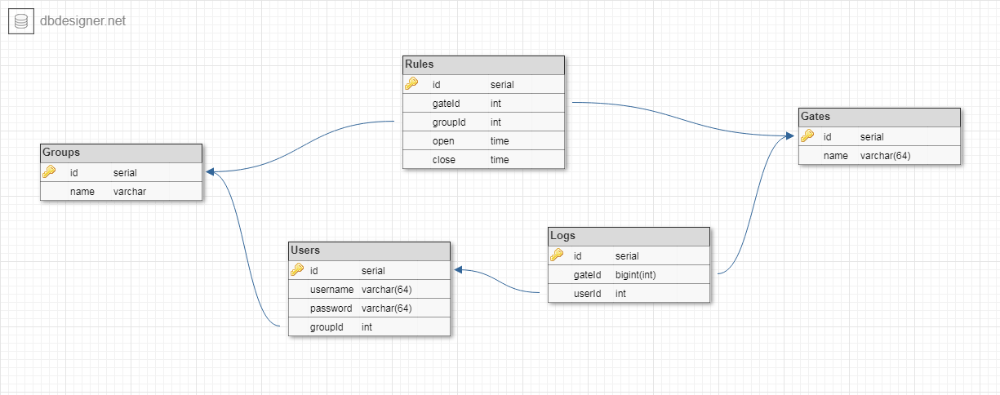

# Database Schema



# API Documentation

## Auth

```json
// sample request

{
    "username": "ronald",
    "password": "ronald",
    "gateId": 1
}
```

```json
// sample response

{
    "id": 1,
    "userId": 1,
    "gateId": 1,
    "updatedAt": "2019-05-06T21:52:25.832Z",
    "createdAt": "2019-05-06T21:52:25.832Z"
}
```

### Login (`POST` `/login`)

- Parameters:
    - `username`: `STRING`
    - `password`: `STRING`
    - `gateId`: `INTEGER`
- Returns:
    - `{ "result": { log object for current login } }`
- Errors:
    - `400` - `{ "message": "[parameter] is required" }`
    - `404` - `{ "message": "Not found" }` (Invalid credentials or gateId)

## Gate

```json
{
    "id": 1,
    "name": "Gate Name",
    "createdAt": "2019-05-06T22:35:30.260Z",
    "updatedAt": "2019-05-06T22:35:30.260Z"
}
```

### Gate List (`GET` `/gates`)

- Query Parameters:
	- None
- Returns:
	- `{ "result": [ list of gate object ] }`
- Errors:
	- `{ "message": "error message"  }`

### Create Gate (`POST` `/gates`)

- Parameters:
	- `name`: `STRING`
- Returns:
	- `{ "result": { created gate object } }`
- Errors:
	- `{ "message": [ list of error messages ] }`

### Gate Details (`GET` `/gates/:id`)

- Path Parameters:
	- `:id`: `INTEGER`
- Returns:
	- `{ "result": { gate object } }`
- Errors:
	- `404` - `{ "message": "Not found" }`

### Delete Gate (`DELETE` `/gates/:id`)

- Parameters:
	- `:id`: `INTEGER`
- Returns:
	- `{ "result": 1 if success 0 otherwise }`
- Errors:
	- None

## Group

```json
{
    "id": 1,
    "name": "Mahasiswa",
    "createdAt": "2019-05-06T21:35:20.028Z",
    "updatedAt": "2019-05-06T21:35:20.028Z"
}
```

### Group List (`GET` `/groups`)

- Query Parameters:
	- None
- Returns:
	- `{ "result": [ list of group object ] }`
- Errors:
	- `{ "message": "error message"  }`

### Create Group (`POST` `/groups`)

- Parameters:
	- `name`: `STRING`
- Returns:
	- `{ "result": { created group object } }`
- Errors:
	- `{ "message": [ list of error messages ] }`

### Group Details (`GET` `/groups/:id`)

- Path Parameters:
	- `:id`: `INTEGER`
- Returns:
	- `{ "result": { groups object } }`
- Errors:
	- `404` - `{ "message": "Not found" }`

### Delete Group (`DELETE` `/groups/:id`)

- Path Parameters:
	- `:id`: `INTEGER`
- Returns:
	- `{ "result": 1 if success 0 otherwise }`
- Errors:
	- None

## User

```json
{
    "id": 1,
    "username": "username",
    "password": "password",
    "groupId": 1,
    "createdAt": "2019-05-06T21:46:46.779Z",
    "updatedAt": "2019-05-06T21:46:46.779Z"
}
```

### User List (`GET` `/users[?groupId=x]`)

- Query Parameters:
	- `?groupId`: `INTEGER`
- Returns:
	- `{ "result": [ list of user object ] }`
- Errors:
	- `{ "message": "error message"  }`

### Create User (`POST` `/users`)

- Parameters:
	- `username`: `STRING`
	- `password`: `STRING`
	- `groupId`: `INTEGER`
- Returns:
	- `{ "result": { created user object } }`
- Errors:
	- `{ "message": [ list of error messages ] }`

### User Details (`GET` `/users/:id`)

- Path Parameters:
	- `:id`: `INTEGER`
- Returns:
	- `{ "result": { users object } }`
- Errors:
	- `404` - `{ "message": "Not found" }`

### Delete User (`DELETE` `/users/:id`)

- Path Parameters:
	- `:id`: `INTEGER`
- Returns:
	- `{ "result": 1 if success 0 otherwise }`
- Errors:
	- None

## Rule

```json
{
    "id": 1,
    "open": 6,
    "close": 15,
    "gateId": 1,
    "groupId": 1,
    "createdAt": "2019-05-06T22:16:03.817Z",
    "updatedAt": "2019-05-06T22:16:03.817Z"
}
```

### Rule List (`GET` `/rules[?open=x&close=x&gateId=x&groupId=x]`)

- Query Parameters:
	- `?open`: `INTEGER`
	- `?close`: `INTEGER`
	- `?gateId`: `INTEGER`
	- `?groupId`: `INTEGER`
- Returns:
	- `{ "result": [ list of rule object ] }`
- Errors:
	- `{ "message": "error message"  }`

### Create Rule (`POST` `/rules`)

- Parameters:
	- `open`: `INTEGER`
	- `close`: `INTEGER`
	- `gateId`: `INTEGER`
	- `groupId`: `INTEGER`
- Returns:
	- `{ "result": { created rule object } }`
- Errors:
	- `{ "message": [ list of error messages ] }`

### Rule Details (`GET` `/rules/:id`)

- Path Parameters:
	- `:id`: `INTEGER`
- Returns:
	- `{ "result": { rules object } }`
- Errors:
	- `404` - `{ "message": "Not found" }`

### Delete Rule (`DELETE` `/rules/:id`)

- Path Parameters:
	- `:id`: `INTEGER`
- Returns:
	- `{ "result": 1 if success 0 otherwise }`
- Errors:
	- None

## Log

```json
{
    "id": 1,
    "userId": 1,
    "gateId": 1,
    "updatedAt": "2019-05-06T21:52:25.832Z",
    "createdAt": "2019-05-06T21:52:25.832Z"
}
```

### Log List (`GET` `/logs[?userId=x&gateId=x]`)

- Query Parameters:
	- `?userId`: `INTEGER`
	- `?gateId`: `INTEGER`
- Returns:
	- `{ "result": [ list of log object ] }`
- Errors:
	- `{ "message": "error message"  }`

### Create Log (`POST` `/logs`)

- Parameters:
	- `userId`: `INTEGER`
	- `gateId`: `INTEGER`
- Returns:
	- `{ "result": { created log object } }`
- Errors:
	- `{ "message": [ list of error messages ] }`

### Log Details (`GET` `/logs/:id`)

- Path Parameters:
	- `:id`: `INTEGER`
- Returns:
	- `{ "result": { log object } }`
- Errors:
	- `404` - `{ "message": "Not found" }`

### Delete Log (`DELETE` `/logs/:id`)

- Path Parameters:
	- `:id`: `INTEGER`
- Returns:
	- `{ "result": 1 if success 0 otherwise }`
- Errors:
	- None
